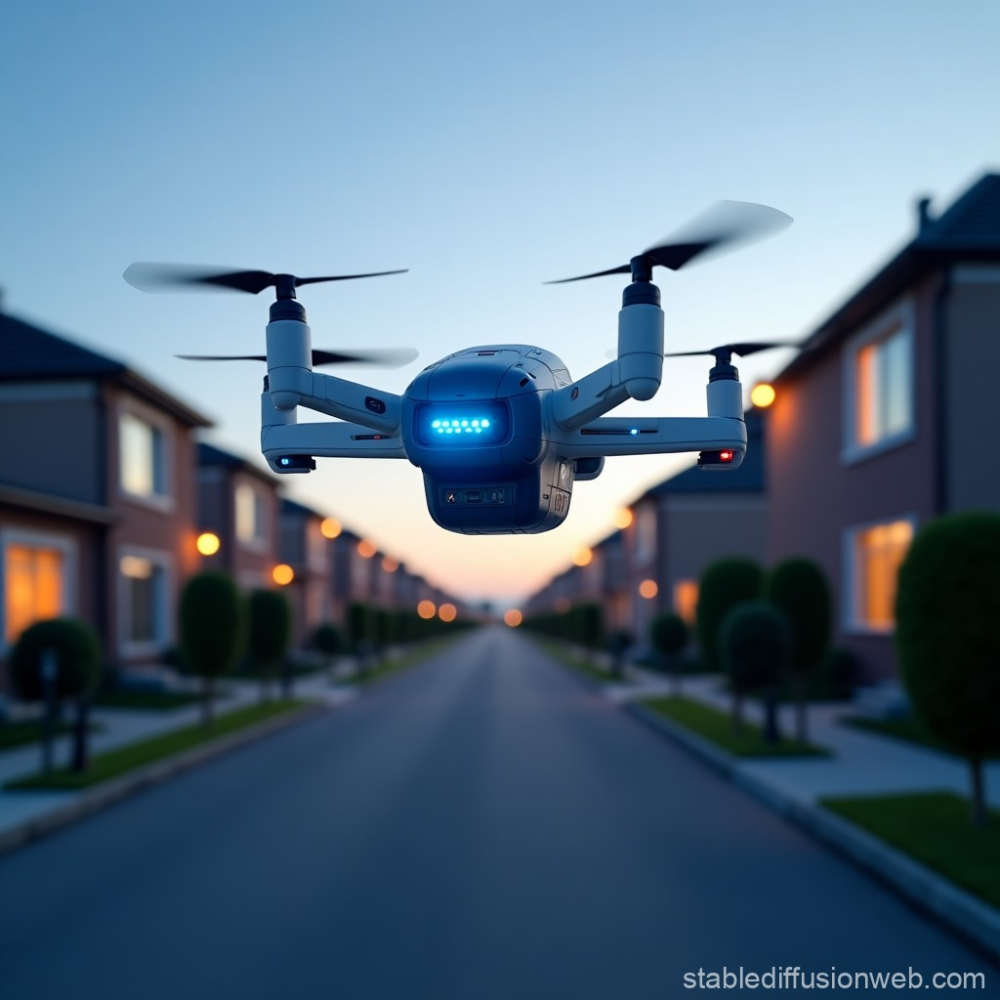

# 🤖 Aegis Aerial Security Drone (AI Concept)

## 📌 Overview

This project presents an **AI-assisted product concept** for a residential security drone, developed using prompt engineering techniques.

It demonstrates how generative AI can support **product ideation, design, and communication**.

---

## 💡 Concept Summary

Aegis Aerial is an AI-powered security drone designed for residential neighbourhoods.

Key capabilities include:

* Autonomous patrol of predefined routes
* Real-time detection of suspicious activity
* Instant alerts with live video streaming
* Automatic return-to-base charging
* Quiet, low-disruption operation

---

## 🧠 AI Tools Used

* ChatGPT — content generation and concept refinement
* Stable Diffusion — image generation

---

## 🛠️ Prompt Engineering

This project involved:

* Iterative prompt refinement
* Comparing outputs across variations
* Adjusting tone, clarity, and technical detail

---

## ⚖️ Ethical Considerations

* Privacy concerns in residential surveillance
* Responsible use of AI-generated content
* Transparency in AI-assisted design

---

## 🎯 Purpose

This project demonstrates:

* AI-assisted product development
* Prompt engineering techniques
* Creative application of generative AI tools

---

## 📷 Concept Visual

